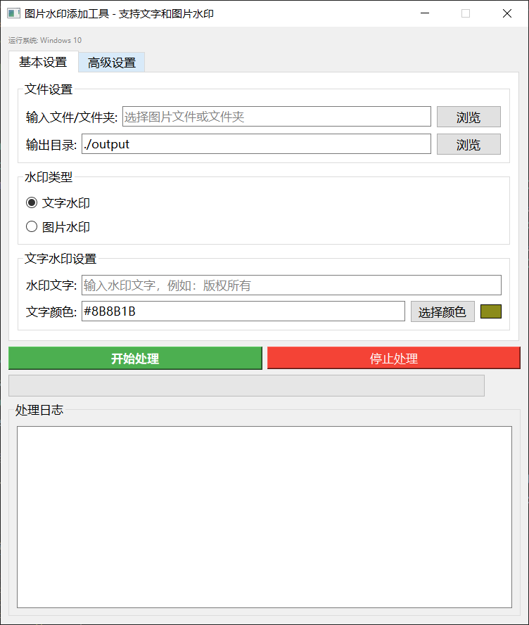
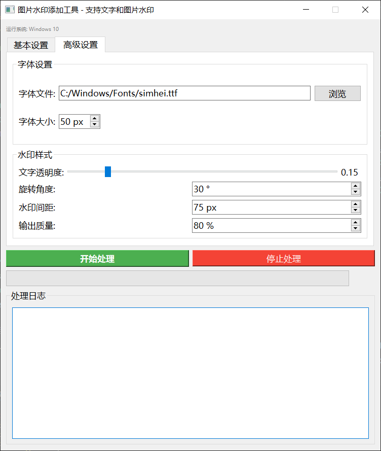
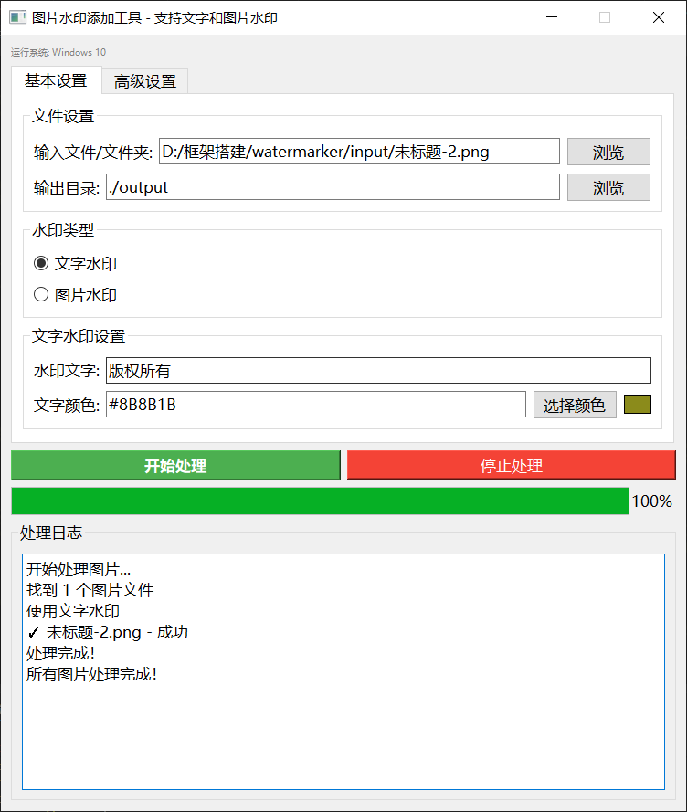

# 图片水印添加工具

一个跨平台的图片水印添加工具，支持文字水印和图片水印。

## 功能特性

- ✅ 支持文字水印和图片水印
- ✅ 跨平台支持 (Windows, macOS, Linux)
- ✅ 图形化界面操作
- ✅ 批量处理图片
- ✅ 自定义水印样式（颜色、透明度、角度、间距）
- ✅ 实时预览和进度显示

## 安装依赖

```bash
pip install PyQt5 Pillow
```

## 运行

```bash
python main.py
```





